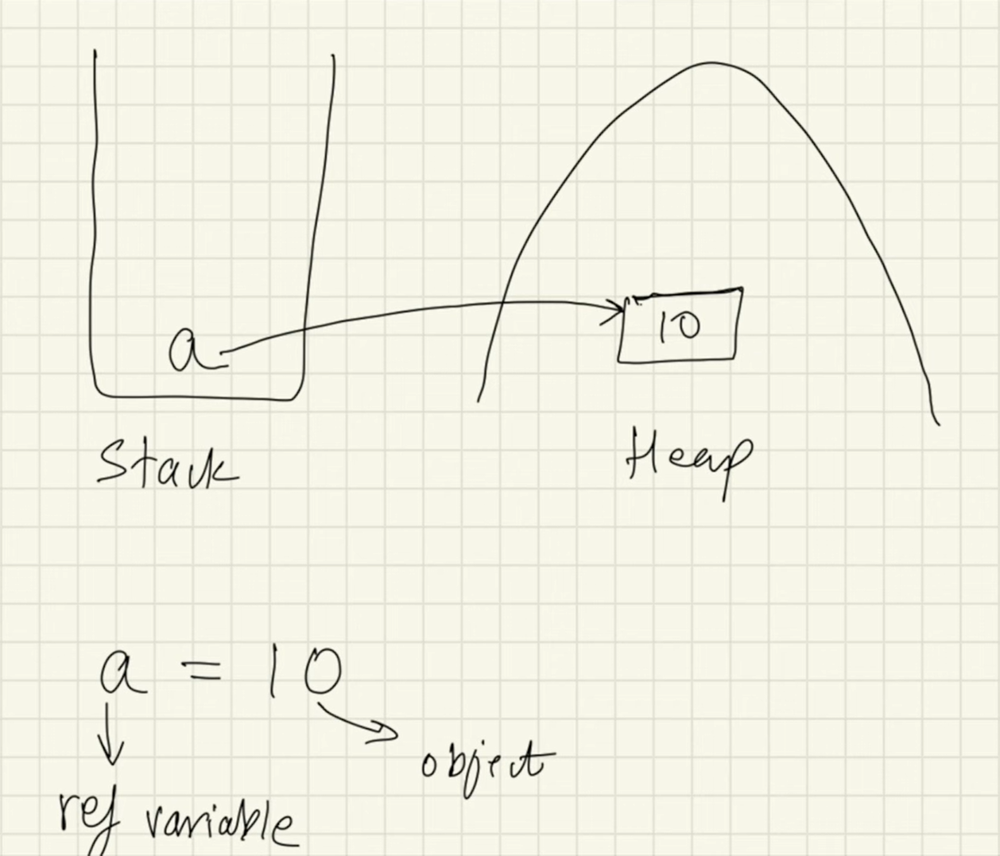
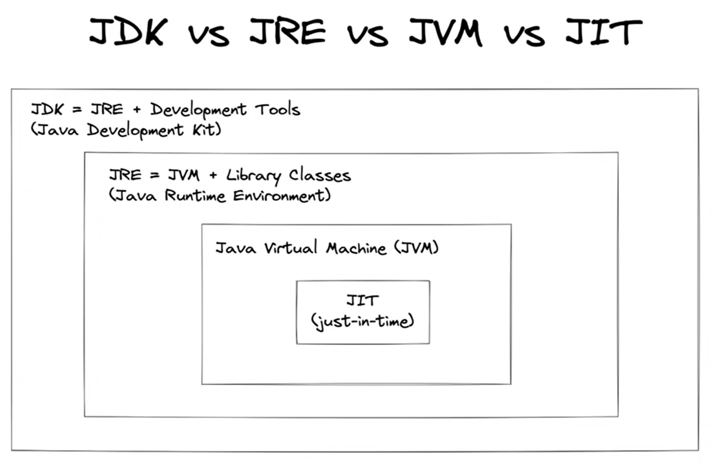
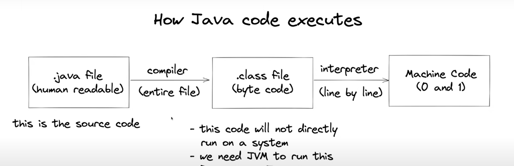

# Java

<!-- vscode-markdown-toc -->
- [Java](#java)
  - [Introduction](#introduction)
    - [Types of Programming Language](#types-of-programming-language)
    - [Object and Reference Variables](#object-and-reference-variables)
  - [Topics](#topics)
    - [Data types](#data-types)
    - [Access Modifiers](#access-modifiers)
    - [Packages](#packages)
    - [Object Cloning](#object-cloning)
  - [Keywords](#keywords)
  - [Object Oriented Programming](#object-oriented-programming)
  - [Interface](#interface)
  - [Brief](#brief)
    - [Java Architecture](#java-architecture)
    - [Garbage Collection](#garbage-collection)

<!-- vscode-markdown-toc-config
	numbering=false
	autoSave=true
	/vscode-markdown-toc-config -->
<!-- /vscode-markdown-toc -->

## <a name='Introduction'></a>Introduction

### <a name='TypesofProgrammingLanguage'></a>Types of Programming Language

- `Procedural`
- `Functional`
- `Object Oriented`

*or*

- `Static`
    - Perform type checking and shows error at compile time
    - Declare data type before using it
- `Dynamic`
    - Perform type checking at runtime and might not show error till runtime.
    - No need to declare datatype of variables

### <a name='ObjectandReferenceVariables'></a>Object and Reference Variables



## <a name='Topics'></a>Topics

### <a name='Datatypes'></a>Data types

- `Primitive data type`: Data types that are predefined by the language and store simple values like number, char, boolean, and always have a value.
- `Non-Primitive data type`: Data types created by programmer or Java to store complex values like String, Integer, Array, Interfaces, and can be null

### <a name='AccessModifiers'></a>Access Modifiers
- `default`: accessible in same package, use for variables that you don't want to use outisde the package
- `public`: accessible everywhere
- `private`: accessible only in that class, for sensitive data, use public getter and setter methods to access and modify
- `protected`: accessible only in subclass

|type|class|package|sublass|global|
|-|-|-|-|-|
|public|+|+|+|+|+|||
|protected|+|+|+|||||
|default|+|+||||||
|private|+|||||||

### <a name='Packages'></a>Packages
Folders inside folders inside folders.
- User Defined:
- In-built:
    - java.lang: 
    - java.io: file reading/writing
    - java.util: data structures, collections framework
    - java.applet: 
    - java.awt: gui
    - java.net: networking

### <a name='ObjectCloning'></a>Object Cloning

- `Shallow copy`: Primitive Data types would be copied as it is, and non-primitive data types are not exactly copied but reference variables points to the same object.
- `Deep copy`: Both data types would be copied as it is.
    
## <a name='Keywords'></a>Keywords

- `new`: dynamically allocates memory and returns a reference to it
- `this`: ****
- `final`: non-access modifier used to make classes, methods, attributes non-changeable, impossible to inherit or override. Useful when you want a variable to always store the same value.
- `static`: When a member is declared static, it can be accessed before any of the object of class is created, and without having reference of any its object.
    1. we can not call non-static functions from a static function, because it requires an instance.
    2. But we can call it referencing their instance in static context. 
    ```java
        class Main {
        	static void fun(){
        		// would show error (a)
        		greeting() 
        		// woulf work (b)
        		Main obj = new Main();
        		obj.greeting()
        	}
        
        	void greeting(){}
        }
    ```
- `super`: refers to super (parent) objects, it is used to call superclass methods and to access superclass constructor. By default it points to Object class.
        

## <a name='ObjectOrientedProgramming'></a>Object Oriented Programming

- `Class`: User-defined template or prototype, which represents the set of properties and method functions.
    <br>
    - **Types of class**
        - `Singleton Class`: When only one instance of class can exist<br>
        ```java
            public class Singleton {
            private Singleton() {}
                
            public static Singleton instance;
            public static Singleton getInstance(){
                if(instance==null)
                    instance = new Singleton();
                return instance;
                }
            }
        ```
        - `Abstract Class`: 
            -   Classes whose objects can't be created, hence need to be inherited from other classes to be used.
            -   Can contain **Abstract methods**, methods which does not have a body, where body is provided by the subclass and also **regular methods** which have a body. 
            -   Can have constructor and static methods, and also final methods which will force the sublass not to change the body of the method.
        ```java
            public abstract class Car(){
                public abstract void company()
                public void price(){

                }
            }
        ```
- `Objects`: Instance of class
- `Inheritance`: When one object inherit aka acquire all the properties and behaviours of parent object.
   - Types of inheritance
        1. Single Level: One class extends another class. A-> B
        2. Multilevel: Multiple level of single inheritance. A-> B-> C
        3. Multiple (!java): One class extends more than one class. A-> C <-B (**Alternative: [Interfaces](#interface)**)
        4. Hierarchial: One class is inherited by many classes. A-> B, A-> C, A-> D
        5. Hybrid (!java): Combination of single and multiple inheritance.
            A-> B, B-> C <-D, D <-A
- `Polymorphism`: 
    - Types of polymorphism
        1. Compile Time/Static: Achieved by method overloading and operator loading (not provided in Java)
        2. Runtime/Dynamic: Achieved by method overriding.
    - Lamguages which don't support polymorphism are know as Object-based programming language instead of Object-oriented programming language.
- `Encapsulation`: Wrapping up the implementation of the data members and methods in class.
- `Abstraction`: Hiding implementation details and showing only functionality to the user.
    Ways to achieve abstraction:
    1. Abstract class (0 to 100%)
    2. Interface (100%)

## <a name='Interface'></a>Interface
Interface is a mechanism to achieve abstraction and multiple inheritance in Java.<br>
**An interface is a blueprint for a class that defines a set of abstract methods and properties that must be implemented by any class that implements the interface**
- Contains only abstract methods, variables are final and static, as we can't create object of Interface, hence can't intialize them using constructors.
- Class can implement multiple interfaces but can only extend one Abstract class.

```java
public interface Engine{
    abstract void start();
    //by default methods are abstract in interfaces
    void stop();
    //static methods should always have a body, as they can't be inherited or overridden
    static void name(){
        System.out.print("CarName");
    }
}

public class Car implements Engine{
    @Override
    public void stop(){}
    @Override
    public void start(){}
    public static void main(String[] args){
        Engine.name();
    }
    
}
```

## <a name='Brief'></a>Brief

### <a name='JavaArchitecture'></a>Java Architecture


- `Java Development Kit`: It is a collection of tools for developing Java applications. With JDK, you can compile programs written in the Java programming Language and run them in JVM. 
  - Consists of:    
    1. development Tools: to develop java program
    2. **JRE**: to execute java program
    3. **compiler**: javac: converts .java to .class
    4. archiver: jar
    5. docs generator: javadoc
    6. interpreter/loader
   
- `Java Runtime Environment`: When you download Java, you get the Java Runtime Environment (JRE).
  - Consists of:
    1. deployment technologies
    2. ui toolkits
    3. integration libraries
    4. base libraries
    5. **JVM**: executes the code line by line
  - Working:
    1. after we get the .class file, class loader loads all the classes that are needed
    2. JVM sends code to Byte code verifier to check the  format of the code
   
- `Java Virtual Machine`: JVM is an abstract computing machine, and executes the programs written. JVM knows nothing of Java programming language, only of a particular binary format i.e. the class file.
  
- `Java Programming Language`: Java is an object-oriented programming language that includes following features:
  - Platform Independence: Java applications are compiled into bytecode, which is stored in class files and loaded in a JVM. Since applications run in a JVM, they can run on many different OS and devices.
  - Object-Oriented
  - Automatic Garbage Collection
  - Rich Standard Library

- `How java executes code`: 


- `JVM Architecture`: 

The HotSpot JVM possesses an architecture that supports a strong foundation of features and capabilities and supports the ability to realize high performance and massive scalability.<br>
The key components of JVM that relate to performance are:
  1. heap: heap is where the object is stored, the area is then managed by garbage collector selected at startup.
  2. garbage collector:
  3. JIT Compiler:

- `Peformance basics`: When tuning Java application, the focus is on one of two main goals
  1. Responsiveness: refers how quickly an application or system responds with a requested piece of data like *how quicky desktop UI responds to an event, how fast a website returns a page or database query is.* For application that focus on responsiveness, large pause times are not acceptable. The focus is responding in short periods of time.
  2. Throughput: focuses on maximixing the amount of work by an application in specific period of time *like number of transactions completed in a given time, number of database queries that can be completed in an hour*.  Since high throughput applications focus on benchmarks over longer periods of time, quick response time is not a consideration.

### <a name='GarbageCollection'></a>Garbage Collection
Automatic garbage collection is the process of looking at heap memory, identifying which objects are in use and which not, and deleting the unused objects.
- An in use object, or a referenced object, means that some part of the programs maintains a pointer to that object.
- An unused object, or unreferenced object, is no longer referenced by any part of the program. So the memory used by unreferenced objects can be reclaimed.
- In programming language like C,allocating and deallocating memory is a manual process, while in Java, process of deallocating memory is handled automatically by garbage collector. The basic process can be described as follows:
  - `Step 1: Marking`: First process where GC identifies which pieces of memory are in use and which are not. But this can be very time consuming process to scan and mark all the objects.
  - `Step 2: Normal Deletion`: Removes unreferenced objects. The memory allocator holds references to blocks of free space where new objects can be allocated.
  - `Step 2a: Deletion with Compacting`: To further improve performance, we can also compoact the remaining the referenced objects together, which makes new memory allocation much easier and faster.
- `Why Generational Garbage Collection?`: As stated earlier, having to mark and compact all the objects in a JVM is inefficient. As more and more objects are allocated the lists of objects grows and grows leading to linger garbage collection time. However, empiricial analysis of the applications has shows that most objects are short lived. Therefore, heap is broken into smaller parts or generations: 
  - Young Generation: Young generstion is where all new objects are allocated and aged. When this fills up, it causes a **minor garbage collection**. Minor collection can be optimized assuming a high object mortality rate. A young generation full of dead objects is collectec very quickly. Some surviving objects are aged and eventually move to old generation. It's split in three parts: Eden, and two survivor spaces (S0 & S1)<br>
  **Stop the world event**: All minor garbage collections the STW events. This means that all application threads are stopped until the operation completes. Minor garbage collections are always swt events
  - Old or Tenured Generation: Used to store long surviving objects. Once a young gen objects crosses the set threashold, it's moved to the old generation. Eventually the old gen needs to be collected. This event is called **major garbage collections**.
  - Permanent Generation: It contains metadata required by JVM to describe he classes and methods used in the application. Also Jave SE library classes and methods may be stored here.
  - `Process`: When an object is created, it's initially places in the Eden space, as the Eden space fills up, minor garbage collection is triggered, whch cleans the Eden space by removing unused onjects and moving the surviving objects to one the survivor spaces (S0 & S1). After subsequent minor gc events, objects switches between survivo spaces, and those survive several such cycles are moved to the Old Generation.
- Types of Garbage Collector:
  - `Serial GC`: In serial collector, both minor and major garbage collection are done serially (using single virtual CPU). In addition it uses, mark-compact collection method. This method moves older memory to the beginning of the heap so that new memory allocation are intro a single continuous chunk of memroy at the end of the heap, resulting in faster allocation of memory.
  - `Parallel GC`: Parallel collector uses multiple thread to perform young generation garbage collection.  Also known as Throughput collector, since it can use multiple CPUs to speed up application throughput.
  - `CMS (Concurrent Mark-Sweep) GC`: It operated by concurrently marking reachable objects while application is running. The **sweep** phase, is also done concurrently, reducing pause times.
  - `G1 GC`: Garbage First or G1 GC is available in Java 7. G1 collector is parallel, concurrent and incrementally compacting low-pause GC that has quite a different layout from other GCs.
[ref](https://www.oracle.com/webfolder/technetwork/tutorials/obe/java/gc01/index.html)
[ref](https://medium.com/@AlexanderObregon/understanding-javas-garbage-collection-bc141a2ef31f)